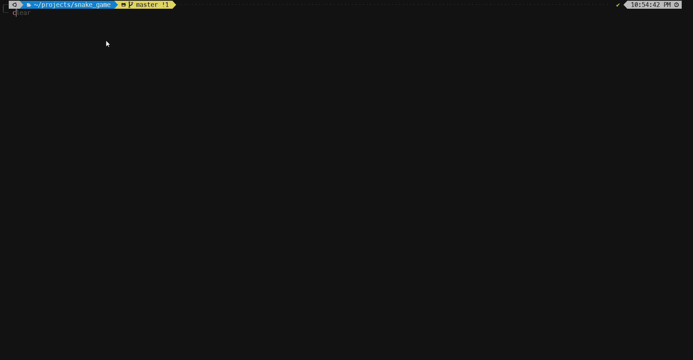

# Snake Game written in Rust

This is an implementation of the snake game's minimal functionality in Rust.

The project currently uses tui and termion under the hood. All graphics are
created using the rectangle object from tui. All the logic for game is centered
within the Snake struct and the game follows a event-update-render loop. The
key events are listened to in another thread. The condition for stopping is
self-collision.

Here's a demo of how the game looks

